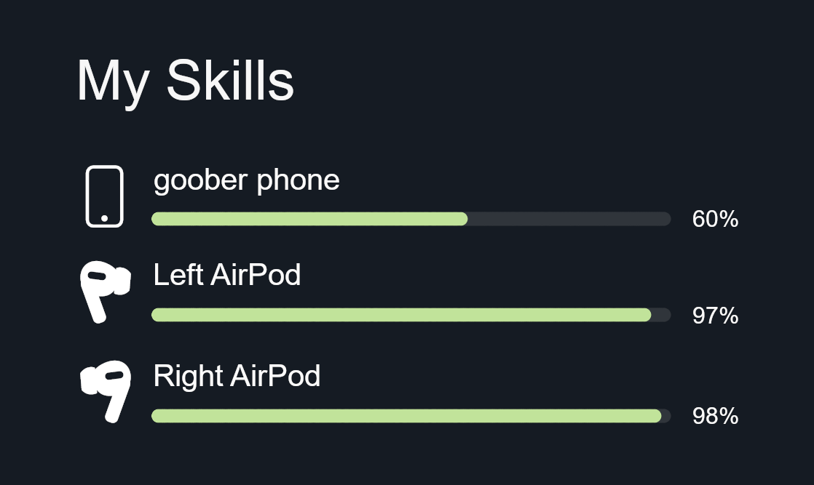

# Hi hello

Aspiring software engineer, passionate about food, money and using AI-powered photosynthesis technology to build scalable serverless digital solutions.

## What I actually do

- Game modding (mostly [Rotwood](https://store.steampowered.com/app/2015270/Rotwood))
- Linux & sysadmin hobbyist
- Scripting and automation
- Self-hosting / home server

## Contacts

- **Email:** gbjgms@gmail.com
- **Discord:** @zgibberish

:3
